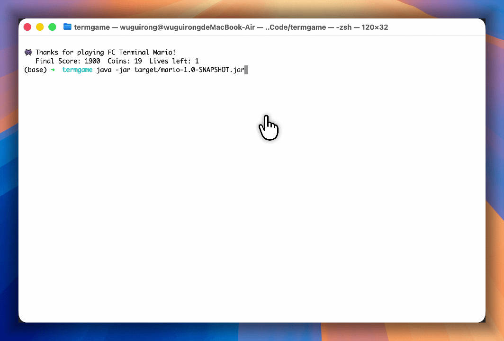
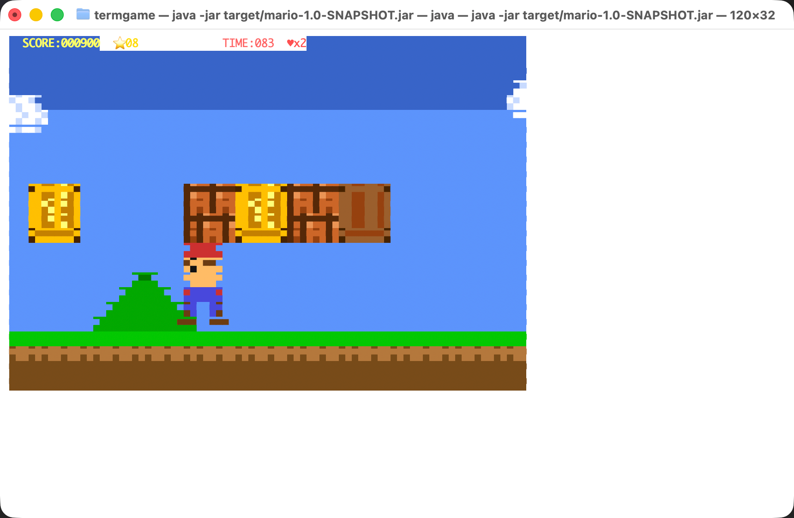

# FC Terminal Mario

<div align="center">


**NES 风格超级玛丽 · 终端版**

一个在终端中运行的模仿超级玛丽风格的游戏，支持 Java 和 Python 两种实现。

[English](#english) | [中文](#chinese)

</div>

---

## 中文

### 项目简介

FC Terminal Mario 是一个在终端中运行的完整超级玛丽游戏，完全使用 ASCII 艺术和 ANSI 颜色代码渲染。游戏包含完整的关卡、敌人、金币、物理引擎和动画效果。

### 特色功能

- 🎮 **完整的游戏体验** - 包含跳跃、踩踏敌人、收集金币、问号方块等经典元素
- 🎨 **精美的像素渲染** - 使用半块字符（▀）实现双倍垂直分辨率
- ⚡ **流畅的物理引擎** - 支持惯性移动、跳跃、碰撞检测
- 🎯 **多语言实现** - 同时提供 Java 和 Python 两个版本
- 🖥️ **跨平台支持** - 支持 macOS、Linux 和 Windows（需支持 ANSI 的终端）

### 演示





### 安装与运行

#### Java 版本

**要求：** JDK 17+

```bash
# 编译
mvn compile

# 运行
mvn exec:java -pl java -Dexec.mainClass="fc.terminal.mario.FCTerminalMario"

# 打包
mvn package

# 运行打包后的 JAR
java -jar java/target/mario-java-1.0-SNAPSHOT.jar
```

**Windows 运行：**
```powershell
# 设置 UTF-8 编码（解决乱码）
chcp 65001
java -jar java/target/mario-java-1.0-SNAPSHOT.jar
```

**注意：** Java 版本使用 JLine 库处理跨平台终端输入

#### Python 版本

**要求：** Python 3.6+

```bash
# macOS/Linux
python3 python/mario.py

# Windows
python python/mario.py
```

**注意：** Windows 终端需要支持 ANSI 颜色代码（Windows 10+ 默认支持）

### 控制方式

| 按键 | 功能 |
|------|------|
| `A` / `←` | 向左移动 |
| `D` / `→` | 向右移动 |
| `空格` / `W` / `↑` | 跳跃 |
| `Q` | 退出游戏 |

### 技术栈

- **渲染引擎** - ANSI 转义序列 + 半块字符（U+2580）
- **输入处理** - 原始终端模式（raw mode）+ 非阻塞 I/O
- **物理引擎** - 自定义 AABB 碰撞检测 + 惯性系统
- **游戏循环** - 60 FPS 固定帧率

### 项目结构

```
termgame/
├── pom.xml                          # 父 POM
├── java/                            # Java 模块
│   ├── pom.xml
│   └── src/main/java/fc/terminal/mario/
│       └── FCTerminalMario.java     # Java 版本
├── python/                          # Python 模块
│   ├── mario.py                     # Python 版本
│   └── requirements.txt
├── screenshots/                      # 游戏截图
├── README.md
├── LICENSE
└── CHANGELOG.md
```

### 游戏机制

- **惯性系统** - 角色移动有加速和减速过程，空中控制力减弱
- **碰撞检测** - 精确的 AABB 碰撞，支持平台、管道、敌人等
- **敌人 AI** - Goomba 自动巡逻，支持踩踏和被踩扁
- **问号方块** - 顶出金币和分数
- **生命系统** - 3 条命，掉落深渊或碰到敌人会损失生命

### 开发计划

- [ ] 添加更多关卡
- [ ] 支持保存/读取游戏进度
- [ ] 添加音效（需要终端音频支持）
- [ ] 支持双人模式
- [ ] 添加更多敌人类型

### 贡献

欢迎提交 Issue 和 Pull Request！

### 许可证

本项目采用 MIT 许可证 - 详见 [LICENSE](LICENSE) 文件

### 致谢

- 灵感来源于任天堂的超级玛丽兄弟
- 像素艺术参考 NES 原版游戏

---

## English

### Introduction

FC Terminal Mario is a NES-style imitation of the Super Mario game running entirely in the terminal, rendered using ASCII art and ANSI color codes. The game features a full level with enemies, coins, power-ups, physics engine, and animations.

### Features

- 🎮 **Complete gameplay** - Jump, stomp enemies, collect coins, break blocks
- 🎨 **Beautiful pixel rendering** - Double vertical resolution using half-block characters
- ⚡ **Smooth physics engine** - Inertia-based movement, jumping, collision detection
- 🎯 **Multi-language** - Available in both Java and Python
- 🖥️ **Cross-platform** - Supports macOS, Linux, and Windows (ANSI-capable terminal required)

### Installation & Running

#### Java Version

**Requirements:** JDK 17+

```bash
# Compile
mvn compile

# Run
mvn exec:java -pl java -Dexec.mainClass="fc.terminal.mario.FCTerminalMario"

# Package
mvn package

# Run packaged JAR
java -jar java/target/mario-java-1.0-SNAPSHOT.jar
```

**Windows:**
```powershell
# Set UTF-8 encoding (fix garbled text)
chcp 65001
java -jar java/target/mario-java-1.0-SNAPSHOT.jar
```

**Note:** Java version uses JLine library for cross-platform terminal input

#### Python Version

**Requirements:** Python 3.6+

```bash
# macOS/Linux
python3 python/mario.py

# Windows
python python/mario.py
```

**Note:** Windows terminal needs to support ANSI color codes (Windows 10+ supports by default)

### Controls

| Key | Action |
|-----|--------|
| `A` / `←` | Move left |
| `D` / `→` | Move right |
| `Space` / `W` / `↑` | Jump |
| `Q` | Quit |

### Tech Stack

- **Rendering** - ANSI escape sequences + half-block characters (U+2580)
- **Input** - Raw terminal mode + non-blocking I/O
- **Physics** - Custom AABB collision + inertia system
- **Game Loop** - Fixed 60 FPS

### License

This project is licensed under the MIT License - see the [LICENSE](LICENSE) file for details